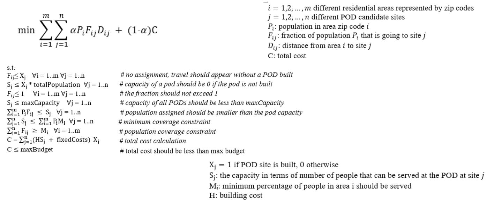

# Multi-objective-Optimization-travel-distance-and-total-cost

This project simulates a pandemic situation and performs optimization on different combinations of travel distance and costs (by considering various scenarios) using gurobipy library in python.

It was developed as an academic group project for the course 94-867 Decision Analytics for Business and Policy class (Spring, 2022) at CMU.

Team members: Yitian Gong, Ravikumar Patel, Yu Zhong

Under the situation of pandemics, these PODs play vital roles in improving public health. This is because Points of Distribution (PODs) are spots that distribute essential supplies and medicines. People could go to different PODs to grab masks, sanitizers, etc. In addition, they are also able to acquire vaccines more conveniently. These could prevent the public from COVID and stay healthy. Even if there is an outbreak within the community, PODs could still help stop the spread of viruses.

This project aims to formulate a facility location model, which helps pick a list of PODs from the candidate sites. Our model has two objectives: 1) minimizing the total travel distance and cost. 2)minimizing the maximum travel distance and cost. To illustrate our model, we would present the model under 3 different scenarios. These scenarios include local outbreak and global spread within Allegheny county.

Mathematical Formulation for the objective optimazation:

Model 1: minimizing total travel distance and cost

Model 2: minimizing max distance and cost

●	models.ipynb:

The python Notebook file models.ipynb is a single file that has all necessary code for running the optimization models model-1 and model-2 of the project and producing the output file in CSV format (model_1_output.csv and model_2_output.csv)

Input data files required to be in the same folder as the Notebook models.ipynb: allegheny_population.csv, distance.csv

Output files: Upon successfully running the Notebook models.ipynb produces the following two csv files which includes the output values for the two models: model_1_output.csv and model_2_output.csv

●	allegheny_population.csv

It is one of the two input data files for the Notebook models.ipynb

Needs to be copied in the same folder as models.ipynb

Data input providing information about total population in each of the 98 zipcodes

Columns: Column 1: zipcode - it contains numerical values of 98 zipcodes. Column 2: population - it contains numerical values of population for each of the 98 zipcodes

The first row of the csv file is headers. The data starts from the second row onwards

●	distance.csv

It is one of the two input data files for the Notebook models.ipynb

Needs to be copied in the same folder as models.ipynb

Data input providing information about the travel distance from each of the 98 zipcodes to each of the 47 POD sites in miles

Columns: Column 1: zipcode - it contains numerical values of 98 zipcodes. Column 2 to 48: POD sites represented by serial number in header row - it contains numerical values of travel distance from each of the 98 zipcodes to the POD sites

The first row of the csv file is headers. The distance values start from the second row onwards

The first column contains indicators of the zipcode. The distance values start from the second column onwards

Each cell (except the first row and the first column) in this csv file represent the distance between the zipcode (mentioned in the first column in the same row as the cell) and the POD site (mentioned in the first row in the same column as the cell)

●	model_1_output.csv

File containing output of model-1 optimal solutions in terms of: the cost, and the total travel distance in miles 

Parameters adjusted for the analysis: Weight coefficient alpha - 19 different values, maximum POD capacity limit - 5 different values

First row is headers

●	model_2_output.csv

File containing output of model-2 optimal solutions in terms of: the cost, the total travel distance for the whole population in miles, and the maximum travel distance for any person in the population

Parameters adjusted for the analysis: Weight coefficient alpha - 19 different values. maximum POD capacity limit - 5 different values

First row is headers

●	site_selection.ipynb

The python Notebook file site selection.ipynb is a single file that has all necessary code for running the optimization models model-1 and model-2 of the project and producing the output file in CSV format (model_1_POD_plan_output.csv and model_2_POD_plan_output.csv)

Output: For each of the two optimization models, running this code produces list of POD sites that should be built under the three outbreak scenario provided as input through outbreak.csv

Input data files required to be in the same folder as the Notebook models.ipynb: allegheny_population.csv, distance.csv, outbreak.csv, 

Output files: Upon successfully running the Notebook models.ipynb produces the following two csv files which includes the output values for the two models - model_1_POD_plan_output.csv and model_2_POD_plan_output.csv

●	outbreak.csv

Input data file for creating three different scenario of outbreaks

First row is header row.

First column: zipcode - provides values of the 98 zipcodes

Other 6 columns provide the fraction of population affected for each of the 98 zipcodes under a specific outbreak scenario

●	model_1_POD_plan_output.csv and model_2_POD_plan_output.csv

This output csv file header row and header column

Other than the header row and column, it has 47 rows for the POD sites and 3 columns for the 3 scenario

These files provide which POD sites should be built under each of the three scenarios for the optimization model 1 and model 2

Value 1 if the POD should be built and 0 if it should not be built

●	Scenarios.twbx

Tableau file for visualizing three different outbreak scenarios (100%, 60%, 30% outbreak)

